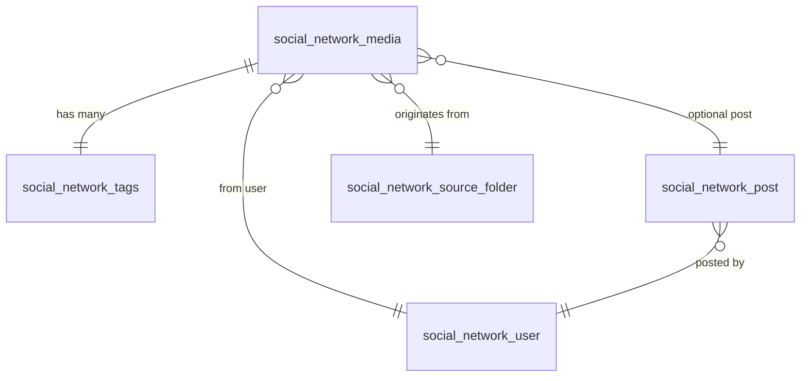

# 📦 Schema Specification for Media Manager Tool (Node.js)

## 💾 List of Schemas

| Schema Name                  | Purpose |
|-----------------------------|---------|
| `social_network_media`      | Stores media file info (images/videos) |
| `social_network_tags`       | Tags for classifying media |
| `social_network_user`       | User information from social networks |
| `social_network_post`       | (Optional) Post containing multiple media |
| `social_network_source_folder` | Source folders or cloud locations |

---

## 📄 `social_network_media`

```js
const SocialNetworkMediaSchema = new Schema({
  filename: { type: String, required: true },
  extension: { type: String },
  type: { type: String, enum: ['image', 'video'], required: true },

  source_type: { type: String, enum: ['local', 's3', 'gdrive', 'facebook', 'x', 'instagram', 'threads'], required: true },
  source_path: { type: String },
  user_source: { type: Schema.Types.ObjectId, ref: 'social_network_user' },

  caption: { type: String },
  size: { type: Number },
  width: { type: Number },
  height: { type: Number },
  mime_type: { type: String },
  created_at: { type: Date, default: Date.now },

  tags: [{ type: Schema.Types.ObjectId, ref: 'social_network_tags' }],
  color_tag: { type: String },
  md5: { type: String, required: true, index: true },
  duplicate_paths: [{ type: String }],
  status: { type: String, enum: ['new', 'reviewed'], default: 'new' },
  post: { type: Schema.Types.ObjectId, ref: 'social_network_post' },
  note: { type: String }
});
```

---

## 🏷️ `social_network_tags`

```js
const SocialNetworkTagSchema = new Schema({
  name: { type: String, required: true, unique: true },
  description: { type: String },
  created_at: { type: Date, default: Date.now }
});
```

---

## 👤 `social_network_user`

```js
const SocialNetworkUserSchema = new Schema({
  platform: { type: String, enum: ['facebook', 'x', 'instagram', 'threads'], required: true },
  username: { type: String },
  fullname: { type: String },
  avatar_url: { type: String },
  profile_url: { type: String }
});
```

---

## 📝 `social_network_post` (Optional)

```js
const SocialNetworkPostSchema = new Schema({
  platform: { type: String, enum: ['facebook', 'x', 'instagram', 'threads'], required: true },
  post_id: { type: String, unique: true },
  content: { type: String },
  user: { type: Schema.Types.ObjectId, ref: 'social_network_user' },
  media: [{ type: Schema.Types.ObjectId, ref: 'social_network_media' }],
  created_at: { type: Date }
});
```

---

## 📁 `social_network_source_folder`

```js
const SocialNetworkSourceFolderSchema = new Schema({
  name: { type: String },
  type: { type: String, enum: ['local', 's3', 'gdrive'], required: true },
  path_or_url: { type: String, required: true },
  active: { type: Boolean, default: true },
  auto_scan: { type: Boolean, default: true },
  created_at: { type: Date, default: Date.now }
});
```

---

## 🔁 Schema Relationships

